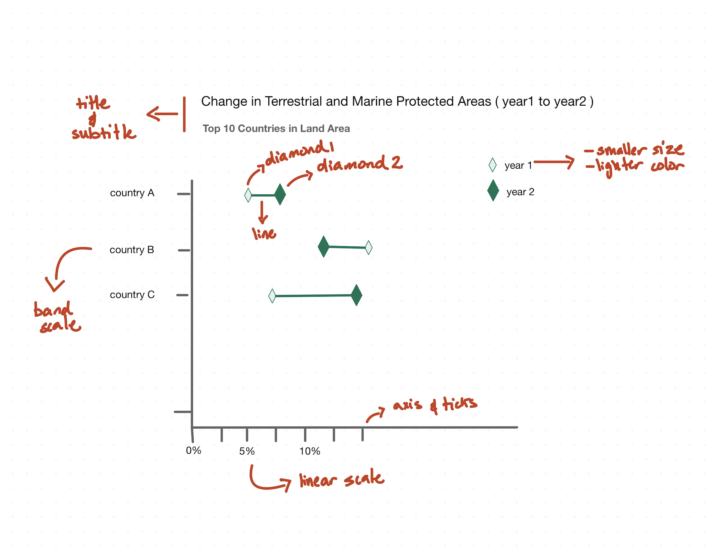

### Northeastern University, Boston 
### Visualization Technologies 2 | Coding-Exercise-1

# Changes in Protected Areas Visualization (2016-2022)
## Overview
This visualization explores the changes in terrestrial and marine protected areas across the world's ten largest countries by land area between 2016 and 2022. The objective is to highlight the relative changes in protected areas for these major nations, providing insights into environmental conservation trends among countries that collectively represent a significant portion of the Earth's land mass. 

This visualization was created as part of the Data Visualization course assignment.

## Dataset
Source Description: "Terrestrial protected areas are totally or partially protected areas of at least 1,000 hectares that are designated by national authorities as scientific reserves with limited public access, national parks, natural monuments, nature reserves or wildlife sanctuaries, protected landscapes, and areas managed mainly for sustainable use. Marine protected areas are areas of intertidal or subtidal terrain--and overlying water and associated flora and fauna and historical and cultural features--that have been reserved by law or other effective means to protect part or all of the enclosed environment. Sites protected under local or provincial law are excluded.","World Database on Protected Areas (WDPA) where the compilation and management is carried out by United Nations Environment World Conservation Monitoring Centre (UNEP-WCMC) in collaboration with governments, non-governmental organizations, academia and industry. The data is available online through the Protected Planet website (https://www.protectedplanet.net/)."

## Visualization Features
The visualization employs several design elements to effectively communicate the data:

X-axis: 
Linear scale from 0% to max % value, gridlines at 5% intervals, and percentage labels

Y-axis: 
Countries arranged in descending order by land area, Russia at the top (17,098,242 km²) and Algeria at the bottom (2,381,741 km²). Distributed along the axis using band scale.

Visual Elements:
- Light turquoise diamonds: 2016 values (serving as reference points)
- Dark turquoise diamonds: 2022 values (emphasized for latest status)
- Connecting lines: Light turquoise paths showing the trajectory and magnitude of change
- Clear spacing between elements for easy country-by-country comparison

## Design Sketch

## Key Findings
Analysis of the visualization reveals several interesting patterns:

- The United States shows the most dramatic change, with a significant decrease in protected areas
- Brazil and Australia maintain the highest percentages of protected areas among the top 10
- India and Algeria have the lowest percentages, both under 5%
- Most countries show relatively stable values, with changes of less than 5 percentage points
- Only a few countries show substantial increases in protected areas

## Country Land Area Reference
The countries are listed in descending order by land area (km²), data taken from Wikipedia (https://en.wikipedia.org/wiki/List_of_countries_and_dependencies_by_area):

Russia (17,098,242)
Canada (9,984,670)
United States (9,525,067)
China (9,596,961)
Brazil (8,515,767)
Australia (7,692,024)
India (3,287,263)
Argentina (2,780,400)
Kazakhstan (2,724,900)
Algeria (2,381,741)

